---
## Front matter
title: "Отчёт по лабораторной работе №3"
subtitle: "дисциплина: Архитектура компьютеров"
author: "Ясиновская Дарья Олеговна"

## Generic otions
lang: ru-RU
toc-title: "Содержание"

## Bibliography
bibliography: bib/cite.bib
csl: pandoc/csl/gost-r-7-0-5-2008-numeric.csl

## Pdf output format
toc: true # Table of contents
toc-depth: 2
lof: true # List of figures
fontsize: 12pt
linestretch: 1.5
papersize: a4
documentclass: scrreprt
## I18n polyglossia
polyglossia-lang:
  name: russian
  options:
	- spelling=modern
	- babelshorthands=true
polyglossia-otherlangs:
  name: english
## I18n babel
babel-lang: russian
babel-otherlangs: english
## Fonts
mainfont: PT Serif
romanfont: PT Serif
sansfont: PT Sans
monofont: PT Mono
mainfontoptions: Ligatures=TeX
romanfontoptions: Ligatures=TeX
sansfontoptions: Ligatures=TeX,Scale=MatchLowercase
monofontoptions: Scale=MatchLowercase,Scale=0.9
## Biblatex
biblatex: true
biblio-style: "gost-numeric"
biblatexoptions:
  - parentracker=true
  - backend=biber
  - hyperref=auto
  - language=auto
  - autolang=other*
  - citestyle=gost-numeric
## Pandoc-crossref LaTeX customization
figureTitle: "Рис."
tableTitle: "Таблица"
listingTitle: "Листинг"
lofTitle: "Список иллюстраций"
lolTitle: "Листинги"
## Misc options
indent: true
header-includes:
  - \usepackage{indentfirst}
  - \usepackage{float} # keep figures where there are in the text
  - \floatplacement{figure}{H} # keep figures where there are in the text
---

# Цель работы

Освоить процедуры оформления отчетов с помощью легковесного
языка разметки Markdown.

# Выполнение лабораторной работы

### 1 
Открыла терминал и перешла в каталог курса, затем обновила локальный репозиторий с помощью команды git pull

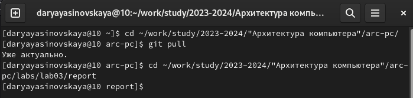{#fig:001 width=80%}

### 2
Перешла в каталог с шаблоном отчета по лабораторной работе №3 

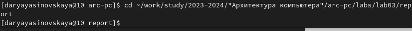{#fig:002 width=80%}

### 3
Провела компиляцию шаблона с помощью команды make

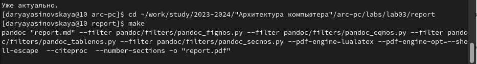{#fig:003 width=80%}

### 4
Убедилась в наличии файлов 

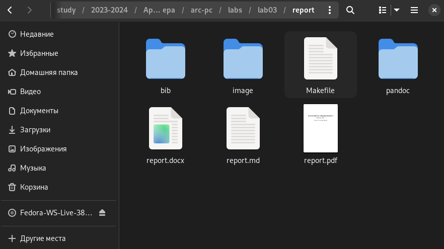{#fig:004 width=80%}

### 5
Удалила полученные файлы с помощью команды make clean

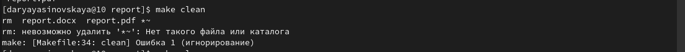{#fig:005 width=80%}

### 6
Убедилась, что файлы удалены

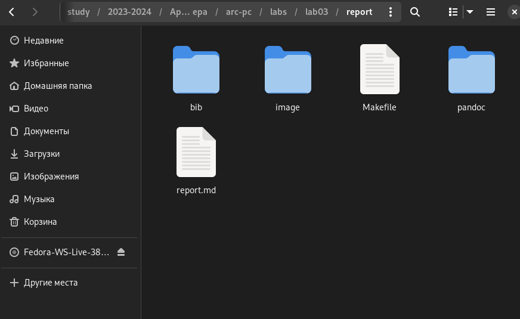{#fig:006 width=80%}

### 7 
Открыла файл report.md с помощью текстового редактора gedit

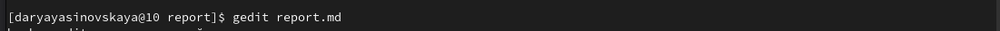{#fig:007 width=80%}

### 8
Изучила структуру файла

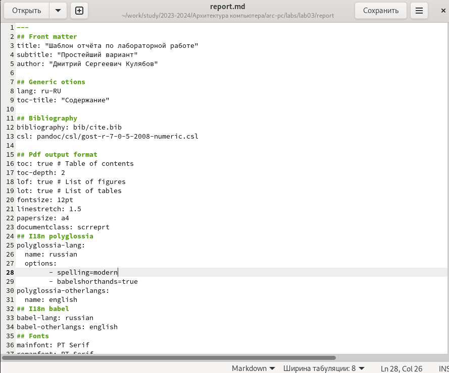{#fig:008 width=80%}

# Самостоятельная работа
### 1
Перехожу в каталог 2-ой лабораторной работы
  
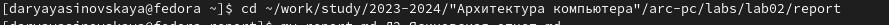{#fig:006 width=80%}
  
### 2
Переименовываю файл и компилирую в pdf и docs формат

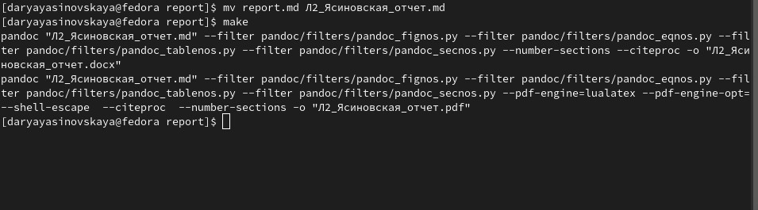{#fig:006 width=80%}

### 3
Проверяю выполнение 

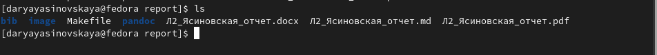{#fig:006 width=80%}

### 4
Загружаю файлы на github.

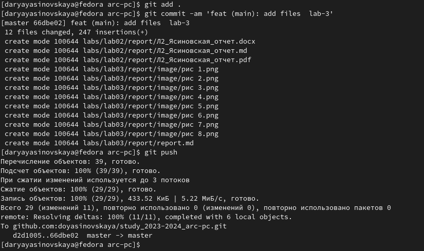{#fig:006 width=80%} 
 
# Выводы

Я освоила процедуры оформления отчетов с помощью легковесного
языка разметки Markdown.

::: {#refs}
:::
