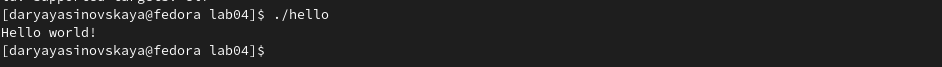

---
## Front matter
title: "Отчёт по лабораторной работе №4"
subtitle: "дисциплина: Архитектура компьютеров"
author: "Ясиновская Дарья Олеговна"

## Generic otions
lang: ru-RU
toc-title: "Содержание"

## Bibliography
bibliography: bib/cite.bib
csl: pandoc/csl/gost-r-7-0-5-2008-numeric.csl

## Pdf output format
toc: true # Table of contents
toc-depth: 2
lof: true # List of figures
fontsize: 12pt
linestretch: 1.5
papersize: a4
documentclass: scrreprt
## I18n polyglossia
polyglossia-lang:
  name: russian
  options:
	- spelling=modern
	- babelshorthands=true
polyglossia-otherlangs:
  name: english
## I18n babel
babel-lang: russian
babel-otherlangs: english
## Fonts
mainfont: PT Serif
romanfont: PT Serif
sansfont: PT Sans
monofont: PT Mono
mainfontoptions: Ligatures=TeX
romanfontoptions: Ligatures=TeX
sansfontoptions: Ligatures=TeX,Scale=MatchLowercase
monofontoptions: Scale=MatchLowercase,Scale=0.9
## Biblatex
biblatex: true
biblio-style: "gost-numeric"
biblatexoptions:
  - parentracker=true
  - backend=biber
  - hyperref=auto
  - language=auto
  - autolang=other*
  - citestyle=gost-numeric
## Pandoc-crossref LaTeX customization
figureTitle: "Рис."
listingTitle: "Листинг"
lofTitle: "Список иллюстраций"
lolTitle: "Листинги"
## Misc options
indent: true
header-includes:
  - \usepackage{indentfirst}
  - \usepackage{float} # keep figures where there are in the text
  - \floatplacement{figure}{H} # keep figures where there are in the text
---

# Цель работы

Целью лабораторной работы является освоение процедуры компиляции и сборки программ, написанных на ассемблере NASM.

# Выполнение лабораторной работы

### 1. Программа Hello world!
 
Создала каталог для работы с программами на языке ассемблера NASM.

{#fig:001 width=80%}

Перешла в созданный каталог и создала файл hello.asm.

{#fig:002 width=80%}

Открыла файл с помощью текстового редактора gedit.

{#fig:003 width=80%}

Ввела текст в созданный файл.

{#fig:004 width=80%}

### 2 Tранслятор NASM

Написала команду nasm -f elf hello.asm, чтобы скомпилировать текст.

{#fig:005 width=80%}

С помощью команды ls проверила, что создан объектный файл с именем hello.o.

{#fig:006 width=80%}

### 3. Расширенный синтаксис командной строки NASM

Выполнила команду nasm -o obj.o -f elf -g -l list.lst hello.asm и скомпилировала исходный файл hello.asm в obj.o. 

{#fig:007 width=80%}

С помощью команды ls проверила, что файлы были созданы.

{#fig:006 width=80%}
  
### 4. Компоновщик LD

Передала файл на обработку компоновщику.

{#fig:006 width=80%}

С помощью команды ls проверяю, что исполняемый файл создан.

{#fig:006 width=80%} 

Выполнила команду ld -m elf_i386 obj.o -o main. Исполняемый файл имеет имя main. Объектный файл, из которого он создан, имеет имя obj.o. 

{#fig:006 width=80%} 

Запустила созданный исполняемый файл с помощью команды ./hello.

{#fig:006 width=80%} 

### 5. Самостоятельная работа

Создала копию файла hello.asm с именем lab4.asm.

{#fig:006 width=80%} 

С помощью текстового редактора изменила файл, вписав туда имя и фамилию, а затем скомпилировала.

{#fig:006 width=80%} 

Транслировала полученный текст программы lab4.asm в объектный файл.

{#fig:006 width=80%} 

Выполнила компоновку объектного файла.

{#fig:006 width=80%} 

Запустила получившийся исполняемый файл.

{#fig:006 width=80%}

Скопировала файлы в локальный репозиторий.
 
{#fig:006 width=80%} 

Загрузила файлы на Github.

{#fig:006 width=80%} 

### Выводы

Я освоила процедуры компиляции и сборки программ, написанных на ассемблере NASM.

::: {#refs}
:::
